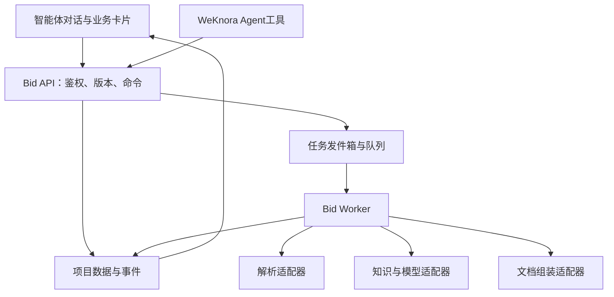

# 02 架构与集成

## 1. 结构

沿用 WeKnora 仓库的 Go 服务、Vue/TypeScript 前端、已有数据库/队列/对象存储和解析服务。新增 bid 业务模块，先部署在同一应用与worker中。文档组装适配器可使用受控 Python worker（python-docx、docxtpl、pypdf、LibreOffice 的选择通过导出样本验证）；版本和许可证在实施时锁定。



## 2. 后端职责

BidProjectService 管项目与范围；TenderAnalysisService 管文档集合、覆盖与要求；MaterialService 管复用策略与证据；FactService 管确认与依赖；CompositionService 管结构化章节；ReviewService 管问题；ExportService 管快照与成册；JobService 管长任务。名称均为新增逻辑设计，P00后映射真实工程风格。

业务层通过下列适配器接入现有能力：

| 适配器 | 输入输出约束 |
|---|---|
| IdentityPolicy | 从请求身份取得租户/用户，检查项目及知识资源访问 |
| ObjectStore | 保存不变原件与产物；返回对象键/哈希，不暴露长期公开链接 |
| DocumentParser | 输入file_version；输出顺序块、表格、图片、来源与失败范围 |
| KnowledgeRetrieval | 输入用户身份、允许资料集合、查询；输出含来源版本的命中 |
| ModelProvider | 使用现有模型配置；校验schema、限制重试与上下文预算 |
| TaskQueue | 复用现有队列，但业务状态以DB为准 |
| DocumentAssembler | 输入文档AST、模板与附件manifest；输出产物和实际组装记录 |

## 3. 前端新增组件（拟定）

BidAgentEntry、BidUploadBridge、BidProgressCard、LotSelectionCard、RequirementSummaryCard、FactConfirmationCard、MaterialGapCard、ChapterTaskCard、ReviewCard、ExportCard、SourcePreviewDrawer、OutlineEditor、SectionEditor、VersionDiffPanel。

复用原有消息组件，并通过消息引用 `bid_card_id` 读取结构化卡片。卡片状态来自业务API，不从Markdown里的按钮或模型文本推导。编辑区可以放右侧抽屉/宽工作区，始终显示当前标段。

## 4. 上传路径决策

默认新增 `POST /api/v1/bid/projects/{project_id}/files` 的持久上传接口；标书模式仅改上传路由，复用现有上传视觉与存储/解析服务。项目先创建（允许title为空显示“待解析项目”），再上传。聊天普通附件维持原路径。

若目标分支可安全复用临时附件：服务端确认附件所有权，复制或原子引用计数提升原件，验证目标对象存在后建立项目文件版本；清理器不能删除仍被项目引用的对象。将适配决策写入 ADR。临时附件读取成功不等于提升成功。

## 5. 持久作业与聊天轮次

上传完成后由后端创建解析任务，并把项目卡片引用写入对话。Agent调用的长任务工具只返回job_id和状态；不让一轮聊天等待解析结束。前端订阅项目事件独立于聊天SSE。聊天停止按钮只停止回答；解析卡片提供单独的“取消解析”，明确各自作用。

## 6. 建议目录布局

```text
internal/bid/{domain,application,repository,adapter,worker}
internal/handler/bid
frontend/src/{api/bid,components/bid,stores/bid,views/bid}
document-worker/bid
docs/bid
```

这只是职责布局建议，若锁定仓库采用不同分层，按既有结构安放，保持 bid 边界清晰。迁移序号、依赖注入、工具注册、RBAC登记必须沿用真实工程机制。

## 7. Agent工具白名单

get_bid_project、start_tender_analysis、get_analysis_result、propose_lot_selection、get_requirements、propose_outline、match_materials、propose_facts、start_chapter_generation、get_review_issues、request_export。所有工具从运行身份取得授权；确认操作需已认证用户动作对应的确认命令，模型不能伪造确认人。自然语言“选第二包”可生成预选卡，歧义时展示候选供点击，不能偷偷选中同名另一个标段。
