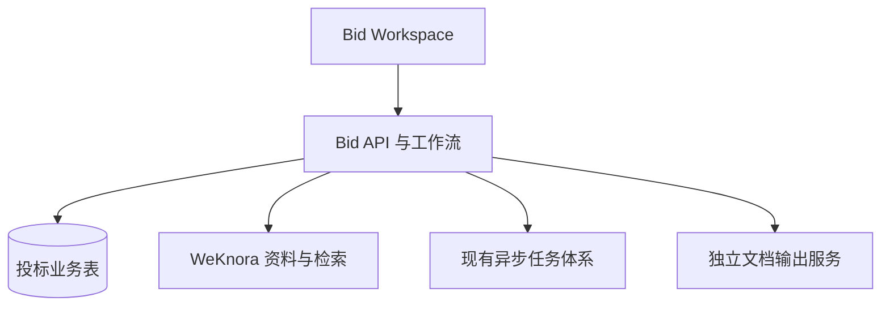

# 架构和集成边界

WeKnora 管文档上传、原件、解析结果、知识库组织、检索、模型配置及现有用户体系；Bid 域管本次项目、包段、要求、事实、目录、章节、审查和导出。Bid 通过实际存在且稳定的服务接口调用现有能力。Phase 0 应检查是否能直接复用内部服务，不能假定 HTTP `/knowledge-search` 是稳定内网契约。

推荐仓库内模块边界：`internal/bid/{handler,service,repository,workflow,types}` 与 `frontend/src/{pages,components,api,stores}/bid`；以仓库真实分层和路由为准。文档输出放独立 `bidwriter` 服务，不耦合 docreader；若现有部署不允许增加 Python 服务，Phase 0 需形成替代方案和性能/保真对比后记录 ADR。

工作流由程序控制：上传、解析、包段确认、要求确认、目录确认、事实确认、资料匹配、章节草稿、审核、导出。LLM 负责有固定输入输出结构的局部任务；Agent 仅提供辅助问答、扩写建议。任务状态持久化，可重试、取消、恢复；重复请求通过幂等键或唯一约束避免重复写入。

边界约束：对招标文件做全量结构遍历与分片提取，不能靠单次 RAG 问答代替；历史材料用受权限过滤的检索。引用冻结时保存文件哈希、解析版本、页码/段落位置和引用文本快照，不能仅存 chunk ID。
